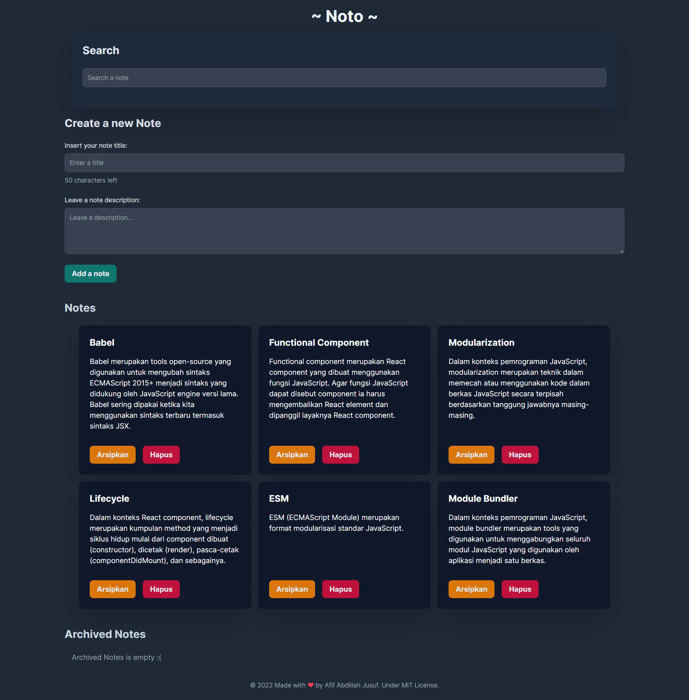

# Noto

just for information, Noto name inspired by japanese "Noto" means a note.

## Dicoding - Membangun Aplikasi Catatan Menggunakan React

Project ini adalah Submission dari Aplikasi Catatan Menggunakan React.

Link Dicoding: [disini](https://www.dicoding.com/academies/403)

## Table of contents

- [Noto](#noto)
  - [Dicoding - Membangun Aplikasi Catatan Menggunakan React](#dicoding---membangun-aplikasi-catatan-menggunakan-react)
  - [Table of contents](#table-of-contents)
  - [Overview](#overview)
    - [Screenshots](#screenshots)
  - [Dicoding Criteria](#dicoding-criteria)
    - [Kriteria Utama 1: Mampu Menampilkan Daftar Catatan](#kriteria-utama-1-mampu-menampilkan-daftar-catatan)
    - [Kriteria Utama 2: Mampu Menambahkan Catatan](#kriteria-utama-2-mampu-menambahkan-catatan)
    - [Kriteria Utama 3: Mampu Menghapus Catatan](#kriteria-utama-3-mampu-menghapus-catatan)
    - [Kriteria Opsional 1: Terdapat Fitur Pencarian Catatan](#kriteria-opsional-1-terdapat-fitur-pencarian-catatan)
    - [Kriteria Opsional 2: Terdapat Limit Karakter pada Input Judul Catatan](#kriteria-opsional-2-terdapat-limit-karakter-pada-input-judul-catatan)
    - [Kriteria Opsional 3: Terdapat Fitur Arsip Catatan](#kriteria-opsional-3-terdapat-fitur-arsip-catatan)
  - [Stack Technology Used](#stack-technology-used)
  - [Getting started](#getting-started)
  - [List Scripts or Commands](#list-scripts-or-commands)
    - [Link](#link)
  - [Developed By](#developed-by)
  - [Thanks to](#thanks-to)

## Overview

Untuk bisa lulus dan mendapatkan sertifikat dari akademi ini, Anda harus mengerjakan tugas yakni membuat proyek “Aplikasi Catatan Pribadi” sesuai kriteria yang tertera. Tim Reviewer akan memeriksa pekerjaan Anda dan memberikan reviu pada proyek yang Anda buat.

### Screenshots




## Dicoding Criteria

Buatlah aplikasi web menggunakan React yang dapat menambahkan dan menghapus catatan. Agar lebih jelasnya, berikut 3 kriteria utama pada “Aplikasi Catatan Pribadi” yang harus Anda buat.

### Kriteria Utama 1: Mampu Menampilkan Daftar Catatan

- Aplikasi harus mampu menampilkan daftar catatan dengan data awal (initial data) yang telah kami sediakan.
- Memanfaatkan state component untuk menyimpan data catatan.
- Menggunakan teknik array map untuk menampilkan daftar catatan.

### Kriteria Utama 2: Mampu Menambahkan Catatan

- Aplikasi harus mampu menambahkan data catatan baru.
- Memanfaatkan controlled component dalam membuat form input.
- Data catatan disimpan cukup pada memori saja (akan hilang jika browser di-refresh).
- Data catatan yang disimpan merupakan objek JavaScript dengan struktur berikut

```javascript
{
  id: number | string,
  title: string,
  body: string,
  archived: boolean,
  createdAt: string,
}
```

Berikut contoh data riilnya:

```
{
  id: 1,
  title: "Babel",
  body: "Babel merupakan tools open-source yang digunakan untuk mengubah sintaks ECMAScript 2015+ menjadi sintaks yang didukung oleh JavaScript engine versi lama. Babel sering dipakai ketika kita menggunakan sintaks terbaru termasuk sintaks JSX.",
  archived: false,
  createdAt: '2022-04-14T04:27:34.572Z'
},
```

Catatan:
Untuk id pada tiap catatan yang disimpan haruslah unik. Tips dalam menetapkan nilai untuk adalah Anda bisa memanfaatkan nilai timestamp. Untuk mendapatkan nilai timestamp di JavaScript cukup mudah, cukup dengan menuliskan expressions +new Date().

### Kriteria Utama 3: Mampu Menghapus Catatan

- Aplikasi harus menyediakan tombol hapus untuk menghapus data catatan yang disimpan.
- Terdapat conditional rendering di mana bila tidak terdapat data catatan, maka UI menampilkan pesan “Tidak ada catatan” atau pesan apa pun yang mengindikasikan data catatan kosong.

Selain kriteria utama, terdapat kriteria opsional yang yang dapat Anda penuhi agar mendapat nilai yang lebih tinggi.

### Kriteria Opsional 1: Terdapat Fitur Pencarian Catatan

- Aplikasi memiliki fitur pencarian catatan berdasarkan kata kunci yang dimasukkan, dengan ketentuan:
  - Jika kolom pencarian tidak kosong, maka aplikasi hanya menampilkan daftar catatan yang judulnya mengandung kata kunci yang dimasukkan.
  - Jika kolom pencariannya kosong, maka aplikasi menampilkan seluruh catatan.
- Memanfaatkan controlled component dalam membangun fitur catatan.

### Kriteria Opsional 2: Terdapat Limit Karakter pada Input Judul Catatan

- Aplikasi dapat mencegah pengguna untuk memberikan judul catatan lebih dari 50 karakter.
- Menggunakan state dalam melimitasi, bukan atribut maxlength.
- Menampilkan jumlah karakter tersisa yang dapat digunakan oleh pengguna.

### Kriteria Opsional 3: Terdapat Fitur Arsip Catatan

- Aplikasi memiliki fitur arsip catatan.
- Aplikasi harus menyediakan tombol arsipkan/pindahkan untuk mengarsipkan atau memindahkan catatan dari arsip.
- Daftar catatan yang diarsip harus ditampilkan pada tempat terpisah dari catatan yang tidak diarsip.

## Stack Technology Used

- [Vite](https://vitejs.dev) with [React](https://reactjs.org), [TypeScript](https://www.typescriptlang.org) and [absolute imports](https://github.com/aleclarson/vite-tsconfig-paths).
- [Tailwind CSS v3](https://tailwindcss.com) with a [basic reset for form styles](https://github.com/tailwindlabs/tailwindcss-forms) and a [Prettier plugin](https://github.com/tailwindlabs/prettier-plugin-tailwindcss) that automatically sorts classes.
- Use [ESLint](https://eslint.org), [stylelint](https://stylelint.io) and [Prettier](https://prettier.io) on VSCode and before you commit with [Husky](https://github.com/typicode/husky) and [lint-staged](https://github.com/okonet/lint-staged).
- [PWA](https://github.com/antfu/vite-plugin-pwa) with [17/17 Lighthouse score](https://web.dev/pwa-checklist/).
- Write unit and integration tests with [Vitest](https://vitest.dev/) and [Testing Library](https://testing-library.com/).
- Write e2e tests with [Cypress](https://www.cypress.io).
- GitHub Actions for automatic [dependency updates](https://renovatebot.com/), [CodeQL Analysis](https://securitylab.github.com/tools/codeql), running tests and code coverage with [Codecov](https://about.codecov.io/).
- Deploy to [Vercel](vercel.com) with pre-configured [SPA fallback](https://vercel.com/docs/configuration#routes/advanced/spa-fallback).

## Getting started

Clone this repo to your machine:

- Install pnpm first if you doesn't have pnpm

```sh
npm i -g pnpm
```

- Then, install the dependencies:

```sh
pnpm install
```

- Run the projects

```sh
pnpm dev
```

## List Scripts or Commands

- `pnpm dev` - start a development server with hot reload.
- `pnpm build` - build for production. The generated files will be on the `dist` folder.
- `pnpm preview` - locally preview the production build.
- `pnpm test` - run unit and integration tests related to changed files based on git.
- `pnpm test:ci` - run all unit and integration tests in CI mode.
- `pnpm test:e2e` - run all e2e tests with the Cypress Test Runner.
- `pnpm test:e2e:headless` - run all e2e tests headlessly.
- `pnpm format` - format all files with Prettier.
- `pnpm lint` - runs TypeScript, ESLint and Stylelint.
- `pnpm validate` - runs `lint`, `test:ci` and `test:e2e:ci`.

### Link

visit at ([note.afif.dev](https://note.afif.dev/))

## Developed By

Developed by me (Afif Abdillah Jusuf), visit my web at [afif.dev](https://afif.dev) for more contact information

## Thanks to

Dicoding. ([dicoding.com](https://dicoding.com))

Jadilah developer expert menggunakan kurikulum standar internasional dari principal technology owner seperti Google, Microsoft, AWS, IBM, dan LINE
